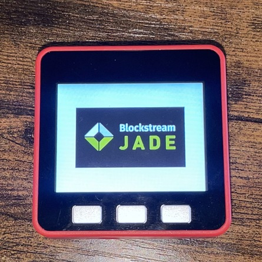

# Jade Do-It-Yourself Hardware Guide

DO NOT follow this guide yet.

It's still under development and requires testing across different hardware and operating systems.

SERIOUSLY, unless you already know what you're doing, do not follow this guide yet until it's compete.

## What is a Jade?

Jade is a bitcoin-only hardware wallet that runs 100% on Open Source code. The firmware that runs Jade can also run other ESP32-compatible.

## Why Should I NOT Read This Guide?

- You have questions about how to use the Jade hardware wallet. Refer to the manufacturer's documentation or contact them instead.

- You're a normie who can't be bothered to learn how to operate a computer. (We will be using the Terminal console which normies find scary.)

- You are not willing to use Linux. (This guide only supports Linux Ubuntu for now but planning to add macOS support soon once I iron out the brew dependencies.)

## Why Should I Read This Guide?

Three words: **supply chain attacks**.

You understand that the person who sells you hardware for your bitcoin should have zero idea that you use it to store bitcoin.

Don't hold more than $100k or more than would be life-changing on a Jade.

## What Hardware Should I Buy?

You are better off buying the hardware directly from the hardware vendor than through a third-party channel like Amazon or Alibaba. In many cases, it's cheaper to buy direct too.

- $10 [TTGO T-Display](https://www.lilygo.cc/products/lilygo%C2%AE-ttgo-t-display-1-14-inch-lcd-esp32-control-board?variant=42720264683701), either the K164 or Q125 variant
    - Does not include a battery
    - DO NOT confuse this hardware with the more expensive T-Display S3 or T-Display AMOLED.
    

- $20 [M5Stack M5StickC PLUS](https://shop.m5stack.com/products/m5stickc-plus-esp32-pico-mini-iot-development-kit)
    - Includes a built-in battery
    - DO NOT confuse this hardware with the older, cheaper M5StickC. The newer PLUS verison with a larger screen is the one to buy.
    

- $40 [M5Stack Core Basic](https://shop.m5stack.com/products/esp32-basic-core-iot-development-kit-v2-6)
    - Nice 3-button design
    

- $50 [M5Stack FIRE v2.6](https://shop.m5stack.com/products/m5stack-fire-iot-development-kit-psram-v2-6)
    - Nice 3-button design, a bigger battery, and a magnetic charging base
    

## Limitations of Third-Party Hardware

- No camera... yet.
- The T-Display doesn't have a battery. You can either (1) keep it plugged in to a wall outlet, keep it plugged into a portable battery charger, or add a generic battery for a few dollars.
- How do you do firmware updates?
- If you enable Secure Boot, you can't lose the pem key.

## Beginner Instructions (without Secure Boot)

1. Open the Terminal by pressing `Ctrl+Alt+T`.

2. Install the required software packages. Copy-and-paste the following lines into Terminal:
    ```bash
    sudo apt update
    sudo apt install -y cmake git python3-pip python3-venv
    [ -d ${HOME}/esp ] || mkdir ${HOME}/esp
    git clone -b v5.0.1 --recursive https://github.com/espressif/esp-idf.git ${HOME}/esp/esp-idf/
    cd ${HOME}/esp/esp-idf
    git checkout a4afa44435ef4488d018399e1de50ad2ee964be8
    ./install.sh esp32
    . $HOME/esp/esp-idf/export.sh
    ```
    - Please note: On a slow computer, this step can take over 20 minutes. 
  
3. Download the Jade source code and load the most recent stable version. Copy-and-paste the following lines into Terminal:
    ```bash
    git clone --recursive https://github.com/blockstream/jade ${HOME}/jade/
    cd ${HOME}/jade/
    ```
  
4. Load the pre-built configuration file for your DIY hardware.
    - For the M5Stack Core, run:
        ```bash
        cp configs/sdkconfig_display_m5blackgray.defaults sdkconfig.defaults
        ```
    - For the M5Stack Fire, run:
        ```bash
        cp configs/sdkconfig_display_m5fire.defaults sdkconfig.defaults
        ```
    - For the M5Stack M5StickC Plus, run:
        ```bash
        cp configs/sdkconfig_display_m5stickcplus.defaults sdkconfig.defaults
        ```
    - For the TTGO T-Display, use:
        ```bash
        configs/sdkconfig_display_ttgo_tdisplay.defaults`.

6. Modify the configuration file you just loaded to disable logging in debug mode (a.k.a. "research and development" mode).
    ```bash
    sed -i.bak '/CONFIG_DEBUG_MODE/d' ./sdkconfig.defaults
    sed -i.bak '1s/^/CONFIG_LOG_DEFUALT_LEVEL_NONE=y\n/' sdkconfig.defaults
    rm sdkconfig.defaults.bak
    ```
  
7. If you haven't done it yet, plug in your device.

8. Enable read-write permissions for your device.
    ```bash
    sudo chmod a+rw /dev/ttyACM0
    ```

9. Flash (install) Jade onto your device. Run the following command in Terminal:
    ```bash
    idf.py flash
    ```
    - Please note: On a slow computer, this step can take over 10 minutes.

10. You should see the Jade initialization screen on your device.

## Advanced Instructions (Secure Boot)

This section is still in progress.
